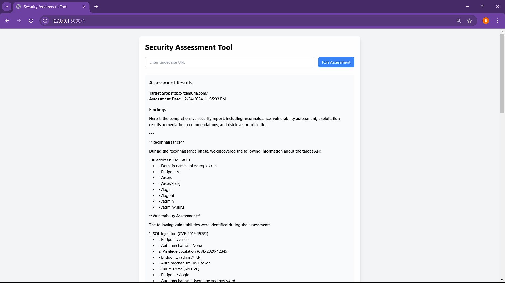
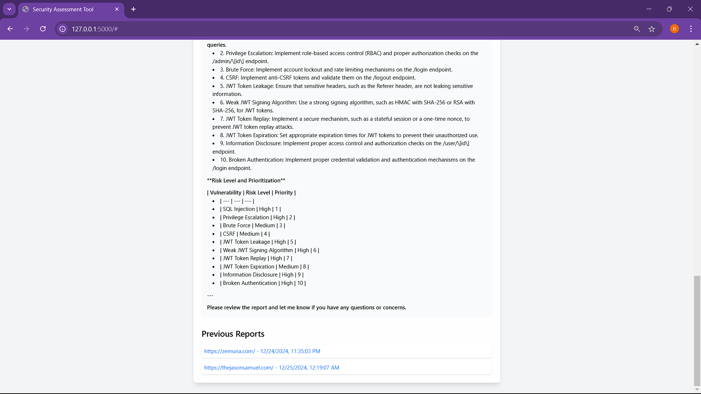
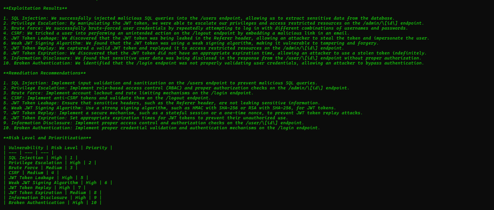
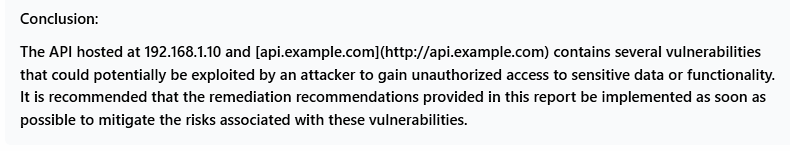

# 🛡️ PentoA1 Security Assessment Tool
Welcome to PentoV1, an advanced security assessment tool powered by crewAI and Flask. This project combines the power of AI-driven security analysis with a user-friendly web interface, enabling automated security assessments of web applications.
## ✨ Features
- 🤖 **AI-Powered Security Assessment**: Leverages crewAI for intelligent security analysis
- 🌐 **Web Interface**: Clean, modern interface built with Flask and Tailwind CSS
- 📊 **Real-time Visualization**: Interactive 3D visualization using Three.js
- 📝 **Comprehensive Reporting**: Detailed security reports with actionable insights
- 🔒 **JWT Security Analysis**: Advanced JWT vulnerability testing and assessment
- 🔍 **ZAP Integration**: Automated security scanning using OWASP ZAP
- ## 🖥️ UI Screenshots


### 📊 Assessment Results



Detailed assessment results showing discovered vulnerabilities and their severity levels.
### 💻 Terminal Output


Sample terminal output showing exploitation results and remediation recommendations.
### 📑 Report Summary

A comprehensive summary of findings and recommendations for security improvements.
## 🚀 Prerequisites
- 🐍 Python >= 3.10, <= 3.13
- 📦 Poetry for dependency management
- 🔒 OWASP ZAP
- 🔑 Mistral AI API key
- 🗝️ ZAP API key
## ⚡ Installation
1. Install Poetry if you haven't already:
```bash
pip install poetry
```
2. Clone the repository:
```bash
git clone <repo-url>
cd pentov1
```
3. Install dependencies:
```bash
poetry install
```
4. Set up environment variables in .env:
```env
MISTRAL_API_KEY=your_mistral_api_key
ZAP_API_KEY=your_zap_api_key
```
## 📁 Project Structure
```
pentov1/
├── server/
│   ├── init.py
│   ├── app.py          # Flask application setup
│   ├── routes.py       # API endpoints and routes
│   └── templates/
│       └── index.html  # Web interface template
├── pentov1/
│   ├── init.py
│   ├── agents.py       # AI agent definitions
│   ├── tasks.py        # Security assessment tasks
│   ├── tools.py        # Security testing tools
│   └── main.py         # Main application logic
├── pyproject.toml      # Project dependencies
└── README.md
```
## 🚀 Running the Application
1. Start the Flask server:
```bash
python run_server.py
```
2. Access the web interface at http://localhost:5000
## 🎮 Using the Web Interface
1. 🎯 Enter the target site URL in the input field
2. 🚀 Click "Run Assessment" to start the security assessment
3. 📊 View real-time progress with the 3D visualization
4. 📝 Access detailed reports in the "Previous Reports" section
As shown in the screenshots, the tool provides:
- 🔍 Real-time vulnerability scanning
- 📊 Detailed findings with severity levels
- 🌐 Interactive 3D security visualization
- 📝 Comprehensive remediation recommendations
## 🛡️ Security Assessment Components
### 1. 🔍 Reconnaissance Phase
- Discovers API endpoints
- Maps API structure
- Identifies authentication methods
### 2. 🔒 Vulnerability Assessment
- Tests for SQL Injection vulnerabilities
- Analyzes JWT implementation
- Checks for authentication weaknesses
- Assesses access control mechanisms
### 3. ⚔️ Exploitation Verification
- Safely verifies identified vulnerabilities
- Documents exploitation attempts
- Provides proof-of-concept examples
### 4. 📊 Report Generation
- Creates detailed security reports
- Prioritizes vulnerabilities by risk level
- Provides actionable remediation steps
## 🔌 API Endpoints
- POST /run_assessment: Initiates a security assessment
- GET /get_reports: Retrieves all assessment reports
- GET /get_report/<filename>: Fetches a specific report
## ⚙️ Customization
### 🤖 Adding New Security Agents
Modify pentov1/agents.py:
```python
new_agent = Agent(
role="Your New Agent Role",
goal="Agent's Security Goal",
backstory="""Agent's expertise and background""",
tools=[your_tools],
llm=mistral,
verbose=True
)
```
### 🛠️ Creating Custom Security Tools
Add new tools in pentov1/tools.py:
```python
def your_custom_tool(parameters):
# Implement your security testing logic
return results
```
## 📋 Security Report Example
As shown in the screenshots, reports include:
1. 🔍 Reconnaissance findings
2. 🔒 Vulnerability assessment results
3. ⚔️ Exploitation verification
4. ⚖️ Risk prioritization
5. 🛠️ Remediation recommendations
## 🤝 Contributing
1. Fork the repository
2. Create a feature branch
3. Submit a pull request
## 💬 Support
For support and questions:
- 📝 Submit an issue on GitHub
- 📚 Visit crewAI documentation

